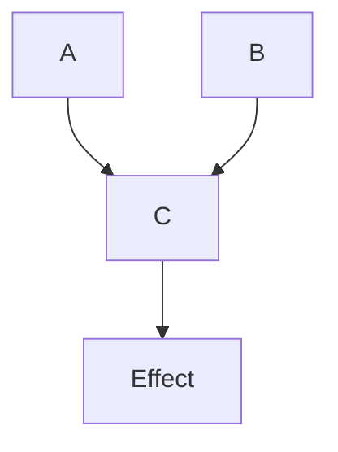
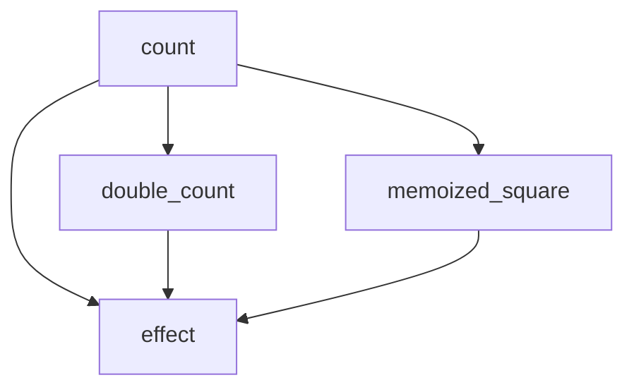

# Reactivity

## What is reactivity?

A few months ago, I completely baffled a friend by trying to explain what I was working on. “You have two variables, right? Call them `a` and `b`. And then you have a third variable, `c`. And when you update `a` or `b`, the value of `c` just _automatically changes_. And it changes _on the screen_! Automatically!”

“Isn’t that just... how computers work?” she asked me, puzzled. If your programming experience is limited to something like spreadsheets, it’s a reasonable enough assumption. This is, after all, how math works.

But you know this isn't how ordinary imperative programming works.

```rust,should_panic
let mut a = 0;
let mut b = 0;
let c = a + b;

assert_eq!(c, 0); // sanity check

a = 2;
b = 2;

// now c = 4, right?
assert_eq!(c, 4); // nope. we all know this is wrong!
```

But that’s _exactly_ how reactive programming works.

```rust
use leptos::*;

run_scope(create_runtime(), |cx| {
    let (a, set_a) = create_signal(cx, 0);
    let (b, set_b) = create_signal(cx, 0);
    let c = move || a() + b();

    assert_eq!(c(), 0); // yep, still true

    set_a(2);
    set_b(2);

    assert_eq!(c(), 4); // ohhhhh yeah.
});
```

Hopefully, this makes some intuitive sense. After all, `c` is a closure. Calling it again causes it to access its values a second time. This isn’t _that_ cool.

```rust
use leptos::*;

run_scope(create_runtime(), |cx| {
    let (a, set_a) = create_signal(cx, 0);
    let (b, set_b) = create_signal(cx, 0);
    let c = move || a() + b();

    create_effect(cx, move |_| {
        println!("c = {}", c()); // prints "c = 0"
    });

    set_a(2); // prints "c = 2"
    set_b(2); // prints "c = 4"
});
```

This example’s a little different. [`create_effect`](https://docs.rs/leptos/latest/leptos/fn.create_effect.html) defines a “side effect,” a bridge between the reactive system of signals and the outside world. Effects synchronize the reactive system with everything else: the console, the filesystem, an HTTP request, whatever.

Because the closure `c` is called within the effect and in turns calls the signals `a` and `b`, the effect automatically subscribes to the signals `a` and `b`. This means that whenever `a` or `b` is updated, the effect will re-run, logging the value again.

You can picture the reactive graph for this system like this:



This is the foundation on which _everything_ else is built.

## Reactive Primitives

### Overview

The reactive system is built on the interaction between these two halves: **signals** and **effects**. When a signal is called inside an effect, the effect automatically subscribes to the signal. When a signal’s value is updated, it automatically notifies all its subscribers, and they re-run.

The following simple example contains most of the core reactive concepts:

```rust
{{#include ../project/ch04_reactivity/src/main.rs}}
```

This creates a reactive graph like this:



**Signals** are reactive values created using [`create_signal`](https://docs.rs/leptos/latest/leptos/fn.create_signal.html) or [`create_rw_signal`](https://docs.rs/leptos/latest/leptos/fn.create_rw_signal.html).

**Derived Signals** computations in ordinary closures that rely on other signals. The computation re-runs whenever you access its value.

**Memos** are computations that are memoized with [create_memo](https://docs.rs/leptos/latest/leptos/fn.create_memo.html). Memos only re-run when one of their signal dependencies has changed.

And **effects** (created with [create_effect](<(https://docs.rs/leptos/latest/leptos/fn.create_effect.html)>) synchronize the reactive system with something outside it.

The rest of this chapter will walk through each of these concepts in more depth.

### Signals

A **signal** is a piece of data that may change over time, and notifies other code when it has changed. This is the core primitive of Leptos’s reactive system.

Creating a signal is very simple. You call `create_signal`, passing in the reactive scope and the default value, and receive a tuple containing a `ReadSignal` and a `WriteSignal`.

```rust
let (value, set_value) = create_signal(cx, 0);
```

> If you’ve used signals in Sycamore or Solid, observables in MobX or Knockout, or a similar primitive in reactive library, you probably have a pretty good idea of how signals work in Leptos. If you’re familiar with React, Yew, or Dioxus, you may recognize a similar pattern to their `use_state` hooks.

#### `ReadSignal<T>`

The [`ReadSignal`](https://docs.rs/leptos/latest/leptos/struct.ReadSignal.html) half of this tuple allows you to get the current value of the signal. Reading that value in a reactive context automatically subscribes to any further changes. You can access the value by simply calling the `ReadSignal` as a function.

```rust
let (value, set_value) = create_signal(cx, 0);

// calling value() with return the current value of the signal,
// and automatically track changes if you're in a reactive context
assert_eq!(value(), 0);
```

> Here, a **reactive context** means anywhere within an `Effect`. Leptos’s templating system is built on top of its reactive system, so if you’re reading the signal’s value within the template, the template will automatically subscribe to the signal and update exactly the value that needs to change in the DOM.

Calling a `ReadSignal` clones the value it contains. If that’s too expensive, use [`ReadSignal::with()`](https://docs.rs/leptos/latest/leptos/struct.ReadSignal.html#method.with) to borrow the value and do whatever you need.

```rust
struct MySuperExpensiveStruct {
    a: String,
    b: StructThatsSuperExpensiveToClone
}
let (value, set_value) = create_signal(cx, MySuperExpensiveStruct::default());

// ❌ this is going to clone the `StructThatsSuperExpensiveToClone` unnecessarily!
let lowercased = move || value().a.to_lowercase();
// ✅ only use what we need
let lowercased = move || value.with(|value: &MySuperExpensiveStruct| value.a.to_lowercase());
```

#### `WriteSignal<T>`

The [`WriteSignal`](https://docs.rs/leptos/latest/leptos/struct.WriteSignal.html) half of this tuple allows you to update the value of the signal, which will automatically notify anything that’s listening to the value that something has changed. If you simply call the `WriteSignal` as a function, its value will be set to the argument you pass. If you want to mutate the value in place instead of replacing it, you can call [`WriteSignal::update`](https://docs.rs/leptos/latest/leptos/struct.WriteSignal.html#method.update) instead.

```rust
// often you just want to replace the value
let (value, set_value) = create_signal(cx, 0);
set_value(1);
assert_eq!(value(), 1);

// sometimes you want to mutate something in place, like a Vec. Just call update()
let (items, set_items) = create_signal(cx, vec![0]);
set_items.update(|items: &mut Vec<i32>| items.push(1));
assert_eq!(items(), vec![1]);
```

> Under the hood, `set_value(1)` is just syntactic sugar for `set_value.update(|n| *n = 1)`.

#### `RwSignal<T>`

This kind of “read-write segregation,” in which the getter and the setter are stored in separate variables, may be familiar from the tuple-based ”hooks” pattern in libraries like React, Solid, Yew, or Dioxus. It encourages clear contracts between components. For example, if a child component only needs to be able to read a signal, but shouldn’t be able to update it (and therefore trigger changes in other parts of the application), you can pass it only the `ReadSignal`.

Sometimes, however, you may prefer to keep the getter and setter combined in one variable. For example, it’s awkward and repetitive to store both halves of a signal in another data structure:

```rust
# use leptos::*;

// pretty repetitive
struct AppState {
    count: ReadSignal<i32>,
    set_count: WriteSignal<i32>,
    name: ReadSignal<String>,
    set_name: WriteSignal<String>
}

#[component]
fn App(cx: Scope) {
    let (count, set_count) = create_signal(cx, 0);
    let (name, set_name) = create_signal(cx, "Alice".to_string());
    provide_context(cx, AppState {
        count,
        set_count,
        name,
        set_name
    })

    todo!()
}
```

Or maybe you just like to keep your getters and setters in one place.

In this case, you can use [`create_rw_signal`](https://docs.rs/leptos/latest/leptos/fn.create_rw_signal.html) and the [`RwSignal`](https://docs.rs/leptos/latest/leptos/struct.RwSignal.html) type. This returns a **R**ead-**w**rite Signal, which has the same [`get`](https://docs.rs/leptos/latest/leptos/struct.RwSignal.html#method.get), [`with`](https://docs.rs/leptos/latest/leptos/struct.RwSignal.html#method.with), [`set`](https://docs.rs/leptos/latest/leptos/struct.RwSignal.html#method.set), and [`update`](https://docs.rs/leptos/latest/leptos/struct.RwSignal.html#method.update) functions as the `ReadSignal` and `WriteSignal` halves.

```rust
# use leptos::*;

// better
struct AppState {
    count: RwSignal<i32>,
    name: RwSignal<String>,
}

#[component]
fn App(cx: Scope) {
    let count = create_rw_signal(cx, 0);
    let name = create_rw_signal(cx, "Alice".to_string());
    provide_context(cx, AppState {
        count,
        name,
    })

    todo!()
}
```

If you still want to hand off read-only access to another part of the app, you can get a `ReadSignal` with [`RwSignal::read_only()`](https://docs.rs/leptos/latest/leptos/struct.RwSignal.html#method.get).

### Derived Signals

(todo)

### Memos

(todo)

### Effects

(todo)
