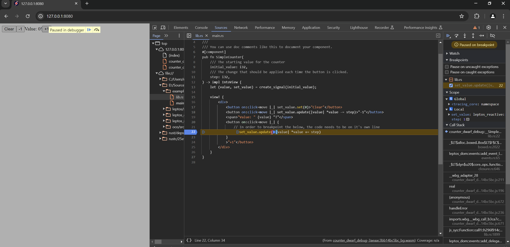
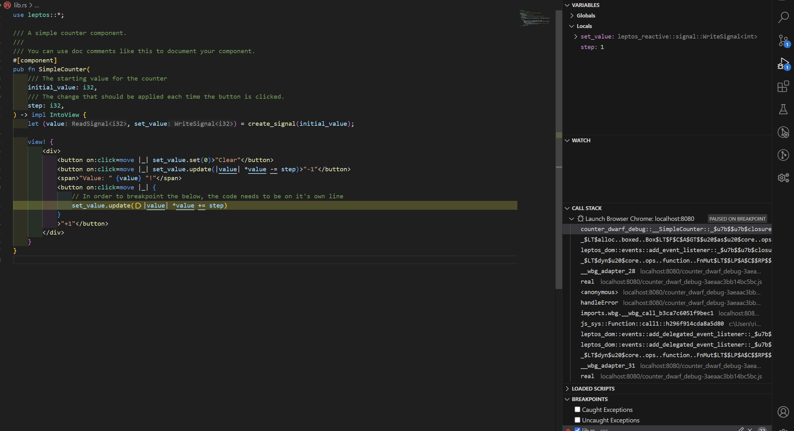

# Debugging Leptos Counter Example in Browser and VSCode

This example builds on the simple counter by adding breakpoints and single stepping the source code for debugging.  
Both within the browser and VSCode.  
This uses a new feature of wasm called Dwarf which is a form of source code mapping.

Note variable inspection during the breakpoints doesn't seem to work at this stage.

## Quick Start

  * Install the requirements below
  * Open this directory within visual studio code
  * Add a breakpoint to the code
  * Launch the example using the visual studio code debug launcher

## How This Works

### Html Changes

First we need to make a change to the index.html file

From this
```html
<link data-trunk rel="rust" data-wasm-opt="z"/>
```

To this
```html
<link data-trunk rel="rust" data-keep-debug="true" data-wasm-opt="z"/>
```

This instructs the rust `trunk` utility to pass a long an option to `wasm-bindgen` called `--keep-debug`  
This option bundles in a type of sourcemap into the built wasm file.  
Be aware that this will make the wasm file much larger.

### Browser Changes

Next we need to allow the browser to read the DWARF data from the wasm file.
For Chrome / Opera there's an extension here that needs to be installed.

  * https://chromewebstore.google.com/detail/cc++-devtools-support-dwa/pdcpmagijalfljmkmjngeonclgbbannb?pli=1

## Debugging within the Browser

Within the browser's dev console it should now be possible to view the rust source code and add breakpoints.



## Debugging within VSCode

Note this is still experimental, although I have managed to get breakpoints working under VSCode.  
So far I've only tried this within a windows environment.

In order to have the breakpoints land at the correct position.  
We need to install the following VSCode extension.

  * [WebAssembly DWARF Debugging](https://marketplace.visualstudio.com/items?itemName=ms-vscode.wasm-dwarf-debugging)

Within the browser launch section under `launch.json` we need to set userDataDir to false in order for the DWARF browser extension to be loaded.
```json
  {
    "name": "Launch Browser Chrome",
    "request": "launch",
    "type": "chrome",
    "url": "http://localhost:8080",
    "webRoot": "${workspaceFolder}/dist",
    // Needed to keep the dwarf extension in the browser
    "userDataDir": false,
  },
```

Now we should be able to add breakpoints within visual studio code while debugging the rust wasm.


